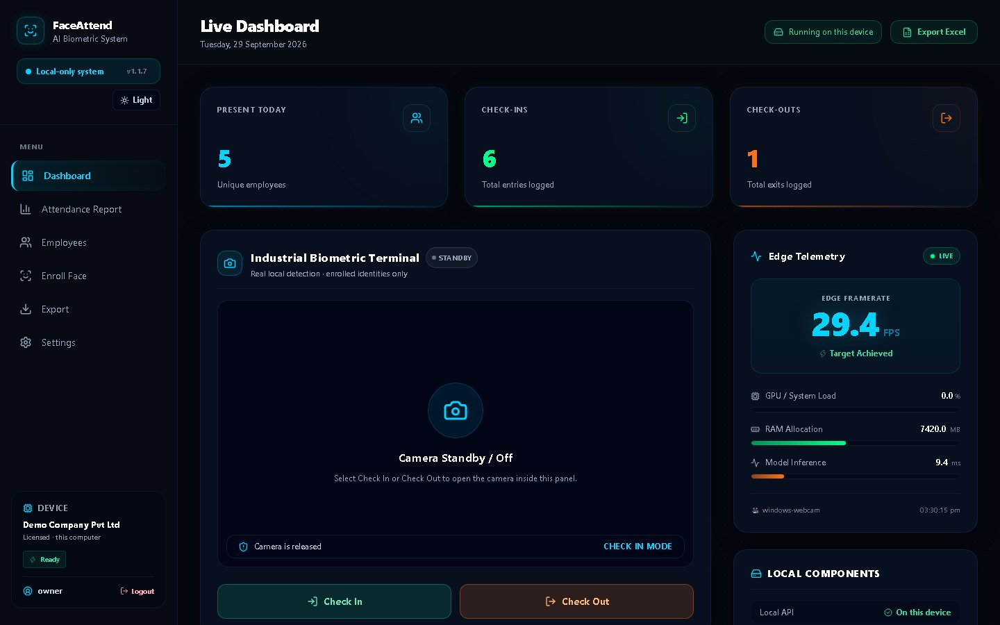
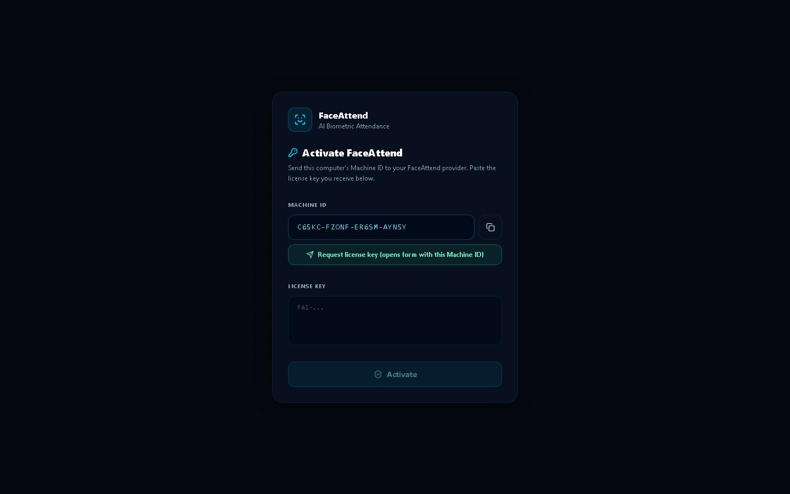
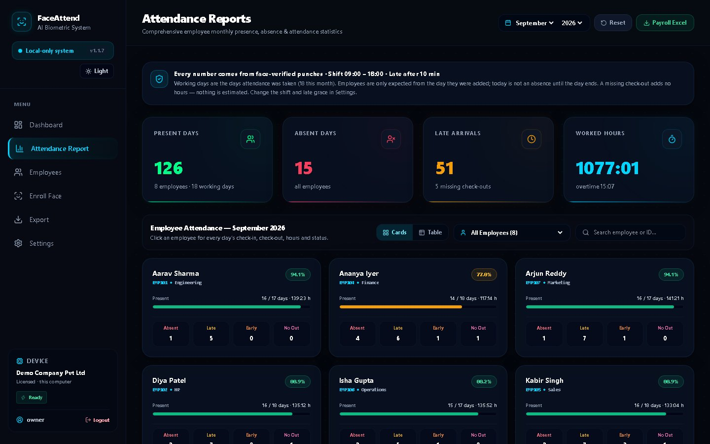
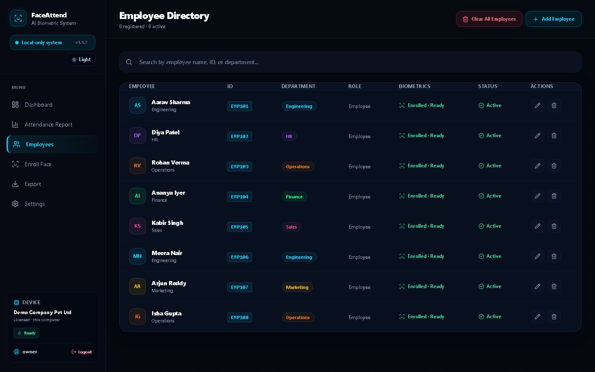

# FaceAttend

**Attendance by face. Fakes don't pass.**

Biometric attendance terminal with liveness and anti-spoof checks, a live dashboard,
monthly reports and Excel export — running entirely on your own computer.

**Website:** https://faceattend-ai.netlify.app

> Screenshots show demo data.

## Download

| Platform | File | How to run |
|---|---|---|
| **Windows 10 / 11** (64-bit) | [`FaceAttend-Setup.exe`](https://github.com/SHASHWAT-MISHRA-997/FaceAttend-downloads/releases/latest/download/FaceAttend-Setup.exe) | Run the installer → open **FaceAttend** from the Start menu |
| **Ubuntu / Debian** (x86_64) | [`faceattend_amd64.deb`](https://github.com/SHASHWAT-MISHRA-997/FaceAttend-downloads/releases/latest/download/faceattend_amd64.deb) | `sudo apt install ./faceattend_amd64.deb` then `faceattend` |
| **Any Linux** (x86_64, portable) | [`faceattend-linux-x86_64.tar.gz`](https://github.com/SHASHWAT-MISHRA-997/FaceAttend-downloads/releases/latest/download/faceattend-linux-x86_64.tar.gz) | `tar -xzf faceattend-linux-x86_64.tar.gz && cd faceattend-*-linux-x86_64 && ./FaceAttend` |

Checksums are in `SHA256SUMS.txt` on each release.
Windows: `Get-FileHash .\FaceAttend-Setup.exe -Algorithm SHA256` · Linux: `sha256sum -c SHA256SUMS.txt --ignore-missing`

> **Windows SmartScreen:** the installer is not code-signed yet, so Windows may show
> “Windows protected your PC”. Choose **More info → Run anyway**. Choose “Install for me only”
> if you do not have administrator rights.
>
> **Linux camera access:** `sudo usermod -aG video $USER`, then log out and back in.

## Getting started

1. **Install** for your operating system (table above). FaceAttend opens in your browser at
   `http://127.0.0.1:3000` — it is reachable only from that computer.
2. **Activate.** The first screen shows this computer's **Machine ID**. Press **Request license key** —
   the [website form](https://faceattend-ai.netlify.app/#license) opens with the ID already filled in —
   and paste the key you receive.

   
3. **Create the owner account** and save the one-time **recovery code**.
4. **Add employees** and **enrol faces** (one clear photo each, in good light).
5. On the dashboard press **Check In** or **Check Out** — people look at the camera and blink.
6. See **Attendance Report** for monthly per-employee figures, or **Export** any date range to Excel.

  
  

## What it does

- Face recognition (YuNet detection + SFace embeddings) with a margin check against look-alikes
- Liveness: requires a blink or small head movement before recording
- Passive anti-spoof model that rejects printed photos and phone/monitor screens
- Check-in, check-out and early exit (SL), with duplicate protection
- Live dashboard, monthly reports, daily Excel workbook and date-range export
- Owner password for management pages; machine-locked license
- Records in the computer's own time zone (daylight saving included)
- 100% local: SQLite database and files in `%LOCALAPPDATA%\FaceAttend` (Windows) or
  `~/.local/share/FaceAttend` (Linux). No cloud, no account.

## System requirements

| | Windows | Linux |
|---|---|---|
| OS | Windows 10 / 11, 64-bit | Ubuntu 22.04+ / Debian 12+ or similar, x86_64 |
| RAM | 4 GB (8 GB recommended) | 4 GB (8 GB recommended) |
| Disk | ≈ 600 MB | ≈ 500 MB |
| Camera | Any USB or built-in webcam | V4L2 webcam |

## About

FaceAttend is proprietary software built and maintained by **Shashwat Mishra**
([LinkedIn](https://www.linkedin.com/in/sm980/) · [GitHub](https://github.com/SHASHWAT-MISHRA-997) ·
[YouTube](https://www.youtube.com/@ShashwatMishra-997)).
This repository contains only the released installers; the source code is not public.
See [LICENSE.txt](LICENSE.txt).
